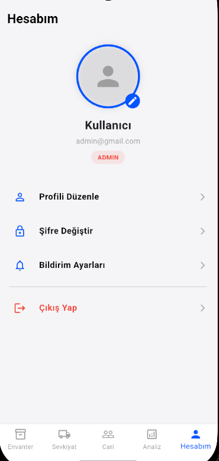
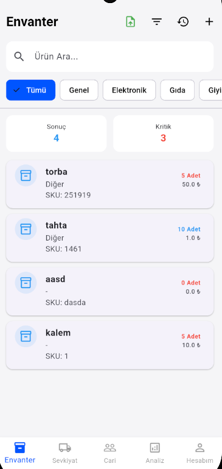
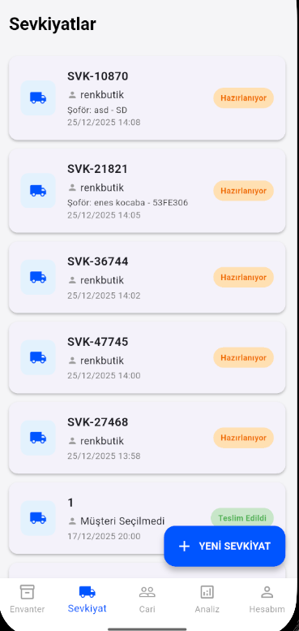

# Envanter Yönetim Uygulaması

Bu proje, 2024-2025 Güz dönemi Mobil Programlama dersi kapsamında geliştirilmiştir.

## 🎯 Projenin Amacı
Geleneksel kağıt/kalem yöntemlerinin yarattığı veri kaybını önlemek, barkod teknolojisi ile stok takibini hızlandırmak ve rol tabanlı yetkilendirme ile güvenli bir yönetim sağlamak.

### ✨ Temel Özellikler
* **Rol Yönetimi:** Admin (Tam Yetki) ve Personel (Kısıtlı Erişim) ayrımı.
* **Hızlı İşlem:** Barkod/QR tarama ve Excel'den toplu ürün yükleme.
* **Sevkiyat Takibi:** Müşteri, şoför ve plaka takibi ile hatasız lojistik.
* **Raporlama:** Otomatik PDF İrsaliye oluşturma ve çıktı alma.
* **Modern Arayüz:** Karanlık Mod (Dark Mode) desteği ve gelişmiş filtreleme.

---

## 📸 Uygulama Ekran Görüntüleri

Uygulamamızın arayüz ve kullanım detayları aşağıdadır:

### 🔐 Giriş ve Hesap İşlemleri
Kullanıcı dostu giriş ekranı ve güvenli hesap yönetimi.

| Giriş Ekranı | Hesap Oluşturma |
| :---: | :---: |
|  |  |

| Hesap Detayları | Şifre ve Ayarlar |
| :---: | :---: |
|  |  |

---

### 📦 Envanter ve Ürün Yönetimi
Ürünlerin listelendiği, filtrelendiği ve yeni girişlerin yapıldığı ekranlar.

| Envanter Listesi | Yeni Ürün Kaydetme |
| :---: | :---: |
|  |  |

  
   
  <em>Envanter hareket dökümü</em>

---

### 🚚 Sevkiyat ve Lojistik
Sevkiyatların planlandığı ve cari hesapların yönetildiği modül.

| Sevkiyat Listesi | Sevkiyat Detayları |
| :---: | :---: |
|  |  |

  
   
  <em>Cari Hesap Yönetimi</em>

---

### ⚙️ Yönetim Paneli
Yöneticiler için genel bakış ve kontrol ekranı.

| Yönetim Ekranı |
| :---: |
|  |
